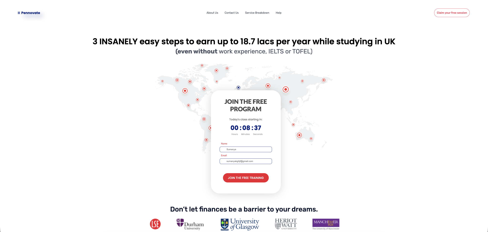

# 🚀 Pennovate - Landing Page / Frontend Template

**Pennovate** is a static frontend landing page template showcasing a promotional layout for a business offering training and services (e.g., free program sign-up).  
The site includes informational sections, call-to-action elements, and visual content designed for conversion-focused presentation.

🌐 **Live Demo:** https://prossew.github.io/Pennovate/

---

## 📌 Project Features

### 📋 Layout Components
- **Hero section** with a countdown timer and primary call-to-action  
- **Lead capture form** for joining free training or program  
- **Benefits section** highlighting advantages of participation  
- **Informational blocks** explaining key points visually  
- **Footer** with company description and navigation links

---

## 🧠 Project Purpose

The main goal of **Pennovate** is to demonstrate a **clean, conversion-oriented static landing page** implemented using core frontend technologies (HTML, CSS, JavaScript). This project can be used as:

- a portfolio piece for frontend development
- a template for real business landing pages
- a learning example for structuring promotional web pages

---

## 💡 Possible Improvements

You may extend this template by adding:

- **Responsive design optimizations** for different screen sizes  
- **Form validation and integration with backend / API**  
- **Analytics tracking (e.g., conversion goals)**  
- **Animations and interactive elements** for enhanced UX  

---

## ⚙️ Tech Stack

- HTML5  
- CSS3  
- GitHub Pages (for deployment)

---

## 📷 Preview

### Homepage


---

## 🚀 Getting Started

To run this project locally:

```bash
git clone https://github.com/prossew/Pennovate.git
cd Pennovate
